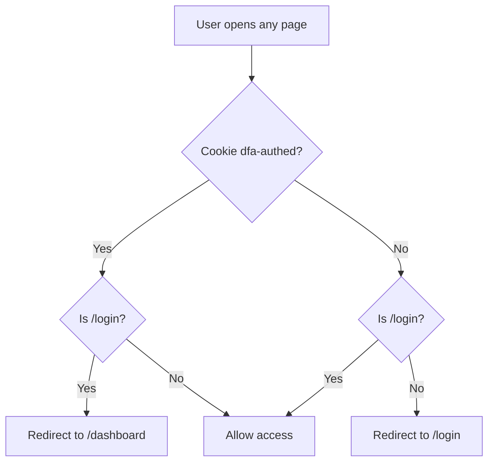
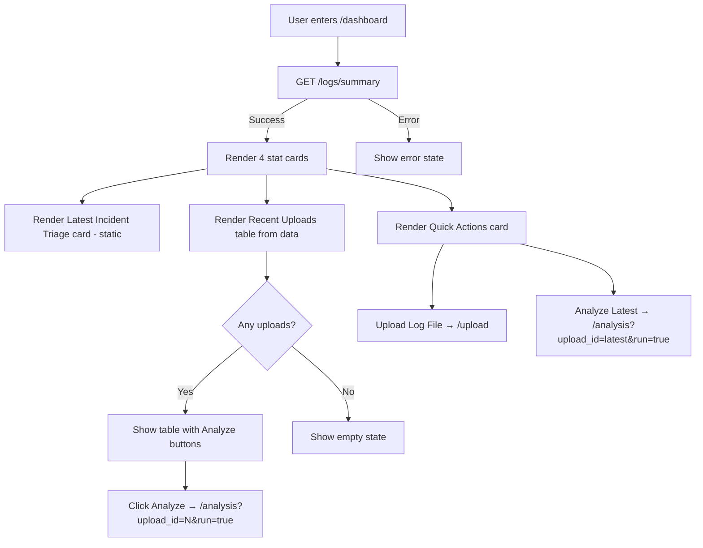
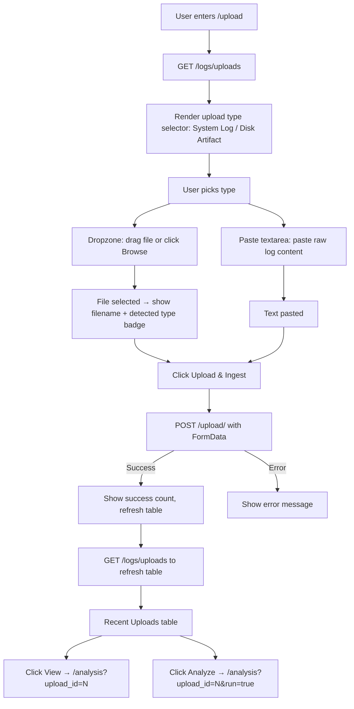
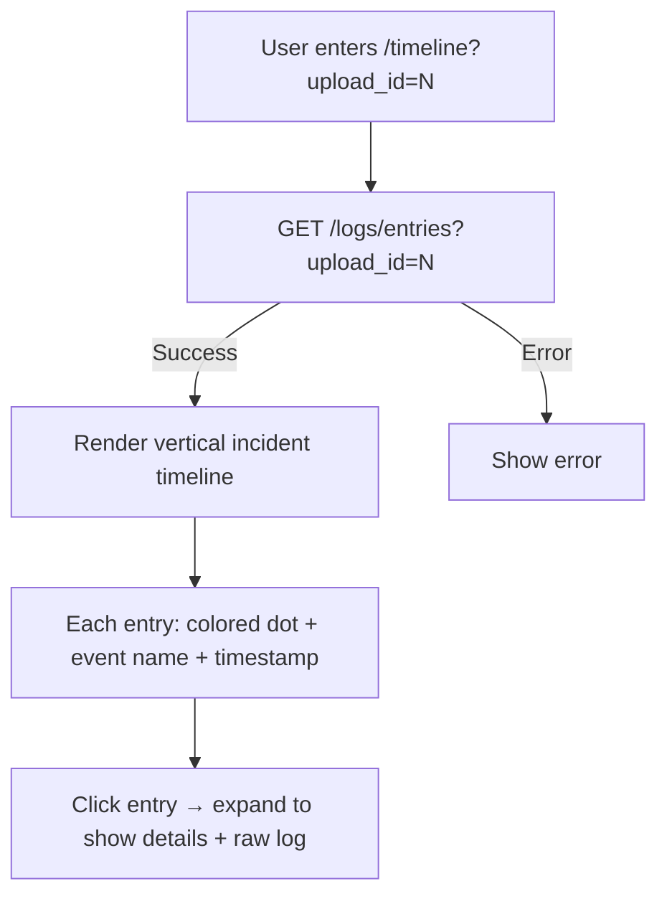
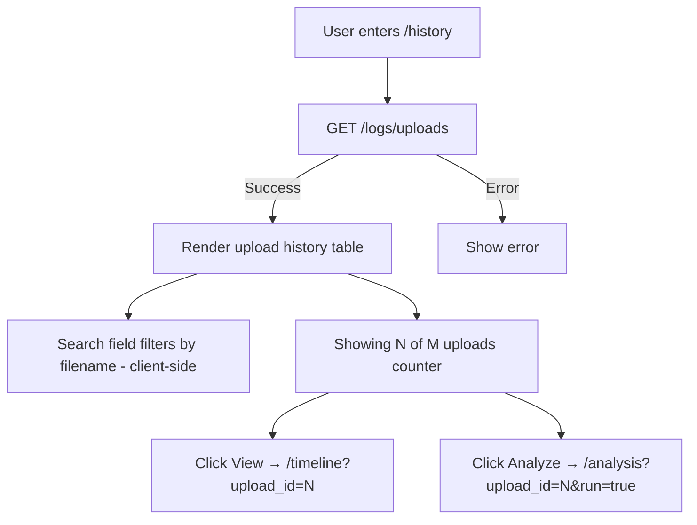
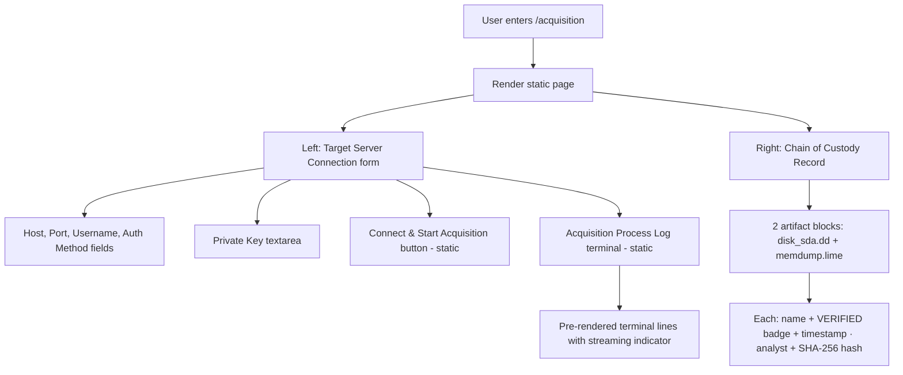
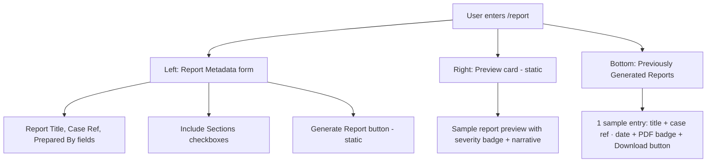
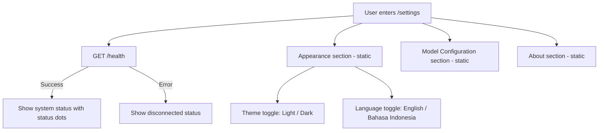

# Page Flow Documentation — DFA Digital Forensics Assistant

## 0. Global Auth Guard (Middleware)



**File:** `frontend/src/middleware.ts`
- Reads `dfa-authed` cookie on every request
- **Not authed + not on /login** → redirect to `/login`
- **Authed + on /login** → redirect to `/dashboard`
- All other cases → allow

---

## 1. Login Page

```mermaid
graph TD
    A[User enters /login] --> B[Render login form]
    B --> C[User fills username + password]
    C --> D[Click Sign In]
    D --> E{Validation}
    E -->|Empty fields| F[Show field errors]
    E -->|Username = "wrong"| G[Show invalid credentials]
    E -->|Valid| H[Set cookie dfa-authed=true]
    H --> I[Redirect to /dashboard]
```

**File:** `frontend/src/app/login/page.tsx`
**API calls:** None (simulated auth)

| Step | Action | Data |
|------|--------|------|
| 1 | Page loads | No data needed |
| 2 | User enters credentials | `username`, `password` |
| 3 | Click "Sign In" | Client-side validation only |
| 4 | Success | Sets `dfa-authed=true` cookie, redirects to `/dashboard` |

**States covered:**
- Empty username → `"Username is required"`
- Empty password → `"Password is required"`
- `username="wrong"` → `"Invalid credentials. Please try again."`
- Any other non-empty → success

**Bottom bar:** Language toggle (EN ↔ ID) + Theme toggle (Light ↔ Dark)

---

## 2. Dashboard Page



**File:** `frontend/src/app/dashboard/page.tsx`
**API calls:** `api.getSummary()` → `GET /logs/summary`

**Response used:**
```json
{
  "total_uploads": N,
  "total_log_entries": N,
  "total_telemetry_entries": N,
  "recent_uploads": [{ "upload_id", "filename", "uploaded_at", "total_entries" }]
}
```

**4 Stat Cards:**
| Card | Field | Icon |
|------|-------|------|
| Total Uploads | `total_uploads` | Upload |
| Log Entries | `total_log_entries` | FileText |
| Telemetry Entries | `total_telemetry_entries` | Activity |
| Critical Alerts | 0 (placeholder) | AlertCircle |

**Actions:**
- **Refresh button** → re-fetch summary
- **Recent Uploads table** → "Analyze" button links to `/analysis?upload_id=N&run=true`
- **Quick Actions** → "Upload Log File" links to `/upload`, "Analyze Latest" links to analysis

---

## 3. Upload Page



**File:** `frontend/src/app/upload/page.tsx`
**API calls:**
| Call | Method | Endpoint | When |
|------|--------|----------|------|
| `api.getUploads()` | GET | `/logs/uploads` | On page load + after upload |
| `api.uploadFile(file)` | POST | `/upload/` | On submit |

**Upload flow:**
1. Select type: **System Log** (`.log`, `.txt`, `.json`) or **Disk Artifact** (`.raw`, `.dd`, `.mem`)
2. Drop file in dropzone **or** paste raw log content in textarea
3. Click **"Upload & Ingest"** → FormData POST to backend
4. Backend auto-detects: JSON → telemetry parser, plain text → auth.log parser
5. Response: `{ filename, upload_id, file_type, total_entries_parsed }`
6. Table refreshes with recent uploads

**States:** Loading, empty (no uploads yet), success message, error message

---

## 4. Analysis Page

```mermaid
graph TD
    A[User arrives at /analysis] --> B{upload_id param?}
    B -->|No| C[Show: Select an upload from History]
    B -->|Yes| D{run=true?}

    D -->|Yes| E[Show AnalysisLoader animation]
    D -->|No| F[Show Run Analysis button]

    E --> G[POST /analyze/ { upload_id }]
    F --> H[User clicks Run Analysis]
    H --> G

    G --> I{Response}
    I -->|Success| J[Render results]
    I -->|Error| K[Show error]

    J --> L[Severity header card]
    J --> M[Narrative Report + Recommendation]
    J --> N[IoC Summary chips - click to copy]
    J --> O[Attack Timeline table - click row to expand raw_message]
```

**File:** `frontend/src/app/analysis/page.tsx`
**API calls:** `api.analyze(uploadId)` → `POST /analyze/`

**Response used:**
```json
{
  "upload_id": N,
  "total_incidents": N,
  "attack_timeline": [{ "id", "timestamp", "event_type", "source_ip", "user", "auth_method", "status", "raw_message" }],
  "ioc_summary": ["ip1", "ip2"],
  "narrative_report": "Multiple failed SSH attempts...",
  "severity_overall": "HIGH"
}
```

**4 Result Sections:**
| Section | Content | Interaction |
|---------|---------|-------------|
| Severity Header | Badge + severity text + incident count | Read-only |
| Narrative Report | LLM-generated narrative split from recommendation | Read-only |
| IoC Summary | IP chips with copy-to-clipboard | Click IP → copy |
| Attack Timeline | Color-coded table rows | Click row → expand raw_message |

**Export button** → downloads full analysis as JSON file

**URL params:**
- `?upload_id=N` → load page, user clicks "Run Analysis"
- `?upload_id=N&run=true` → auto-trigger analysis

---

## 5. Timeline Page



**File:** `frontend/src/app/timeline/page.tsx`
**API calls:** `api.getEntries(uploadId)` → `GET /logs/entries?upload_id=N`

**Response used:** Array of `LogEntry` objects with:
`id, timestamp, host, event_type, source_ip, user, port, auth_method, status, raw_message`

**Visual:** Vertical timeline with colored dots:
- Green dot = Accepted / success events
- Red dot = Failed / error events  
- Yellow dot = Warning / unknown events

**Interaction:** Click any entry → expand inline to show `raw_message` in a code block

---

## 6. History Page



**File:** `frontend/src/app/history/page.tsx`
**API calls:** `api.getUploads()` → `GET /logs/uploads`

**Table columns:** Filename (with file-type badge), Entries count, Date, Actions (View / Analyze)

**Client-side search:** filters uploads by filename matching

---

## 7. Acquisition Page (UI-only)



**File:** `frontend/src/app/acquisition/page.tsx`
**API calls:** None (static UI)

**Purpose:** SSH-based forensic artifact acquisition UI. Currently static — no backend endpoint yet.

**Layout:** 5:2 grid (left wider, right narrower chain card)

---

## 8. Report Page



**File:** `frontend/src/app/report/page.tsx`
**API calls:** None (static UI)

**Layout:** 60:40 grid (left form, right preview) + full-width previous reports below

---

## 9. Settings Page



**File:** `frontend/src/app/settings/page.tsx`
**API calls:** `api.getHealth()` → `GET /health`

**Response used:**
```json
{ "status": "ok", "ollama_connected": false, "chromadb_connected": false }
```

**3 Sections:**
| Section | Content | API |
|---------|---------|-----|
| Appearance | Theme toggle (Light/Dark) + Language toggle (EN/ID) | None |
| System Status | Ollama, ChromaDB, PostgreSQL, API Backend status dots | `/health` |
| Model Configuration | Static model names + API URL | None |
| About | Version + client info | None |

---

## 10. Complete Navigation Flow

```mermaid
graph TD
    Login[/login] -->|Sign In| Dashboard[/dashboard]
    Dashboard -->|Upload Log File| Upload[/upload]
    Dashboard -->|Analyze Latest| Analysis[/analysis?upload_id=N&run=true]
    Dashboard -->|View All| History[/history]
    Dashboard -->|View Full Analysis| Analysis

    Upload -->|View| Analysis[/analysis?upload_id=N]
    Upload -->|Analyze| Analysis[/analysis?upload_id=N&run=true]

    History -->|View| Timeline[/timeline?upload_id=N]
    History -->|Analyze| Analysis[/analysis?upload_id=N&run=true]

    Timeline --> Analysis

    Sidebar[Sidebar Navigation] --> Dashboard
    Sidebar --> Upload
    Sidebar --> Acquisition[/acquisition]
    Sidebar --> Analysis
    Sidebar --> Timeline
    Sidebar --> History
    Sidebar --> Report[/report]
    Sidebar --> Settings[/settings]

    TopBar -->|Logout| Login
    TopBar -->|Language Toggle| ALL[All Pages]
    TopBar -->|Theme Toggle| ALL
```

## 11. API Call Summary

| Page | API Call | Method | Endpoint | Trigger |
|------|----------|--------|----------|---------|
| Login | — | — | — | Static |
| Dashboard | `getSummary()` | GET | `/logs/summary` | Page load + Refresh |
| Upload | `getUploads()` | GET | `/logs/uploads` | Page load + after upload |
| Upload | `uploadFile(file)` | POST | `/upload/` | Click "Upload & Ingest" |
| Analysis | `analyze(id)` | POST | `/analyze/` | URL param `run=true` or button click |
| Timeline | `getEntries(id)` | GET | `/logs/entries?upload_id=` | Page load |
| History | `getUploads()` | GET | `/logs/uploads` | Page load |
| Acquisition | — | — | — | Static (no backend yet) |
| Report | — | — | — | Static (no backend yet) |
| Settings | `getHealth()` | GET | `/health` | Page load |

## 12. State Handling Patterns

Every page follows the same pattern:

```
1. Page mounts → useEffect triggers API call
2. While waiting: loading state (spinner / empty-state)
3. On success: render data
4. On error: show error message
5. Empty data: show empty-state with guidance
```

| State | UI Pattern |
|-------|------------|
| **Loading** | Spinner / AnalysisLoader / "Loading..." text |
| **Error** | AlertCircle icon + error message |
| **Empty** | Large icon + message (e.g., "No uploads yet") |
| **Success** | Normal data rendering |
| **Not ready** | "Select an upload..." guidance (Analysis/Timeline) |
